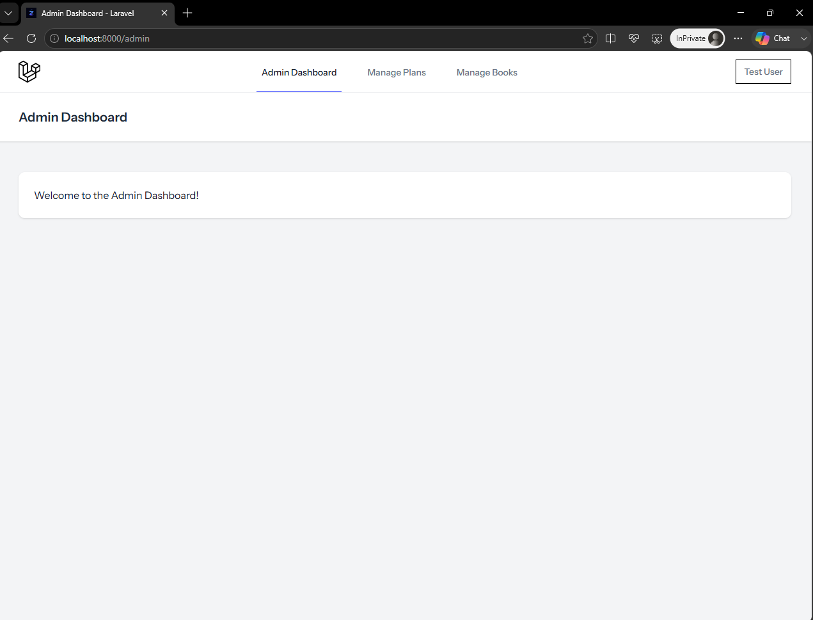
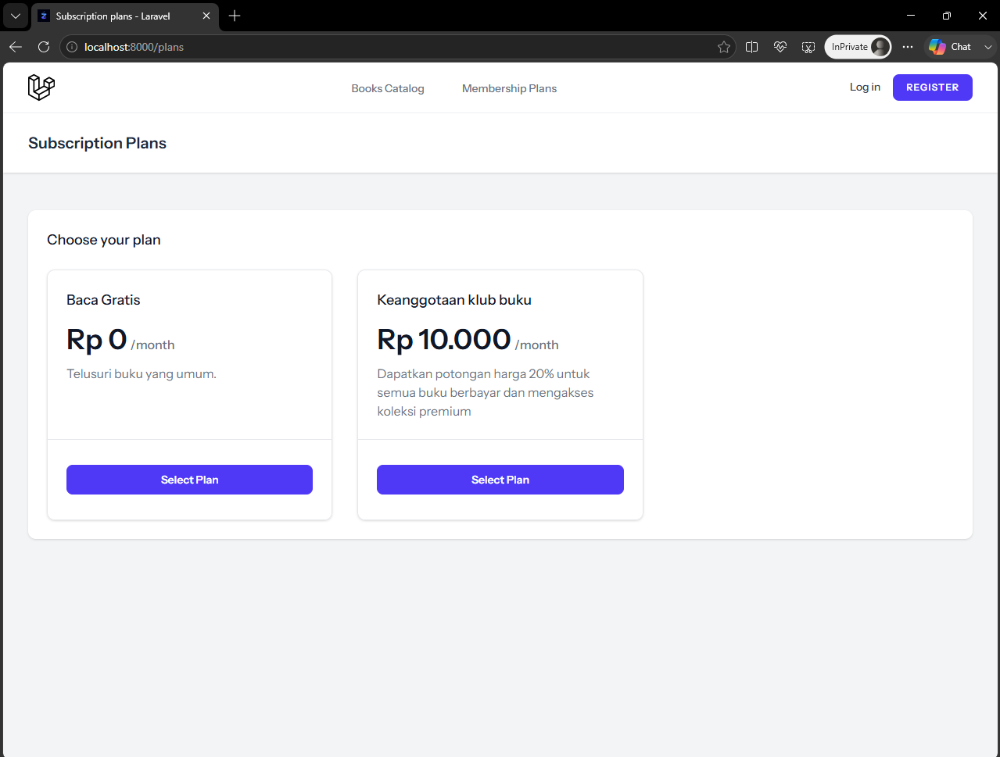
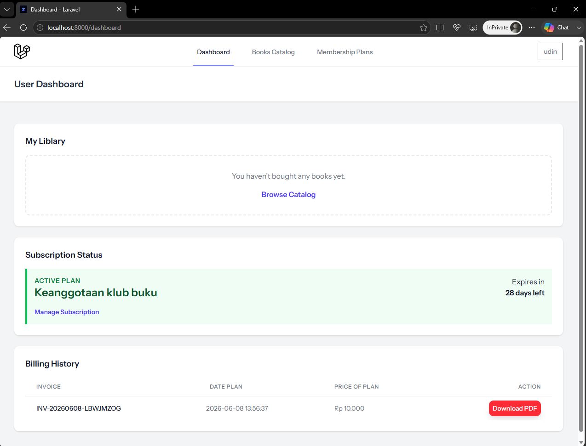
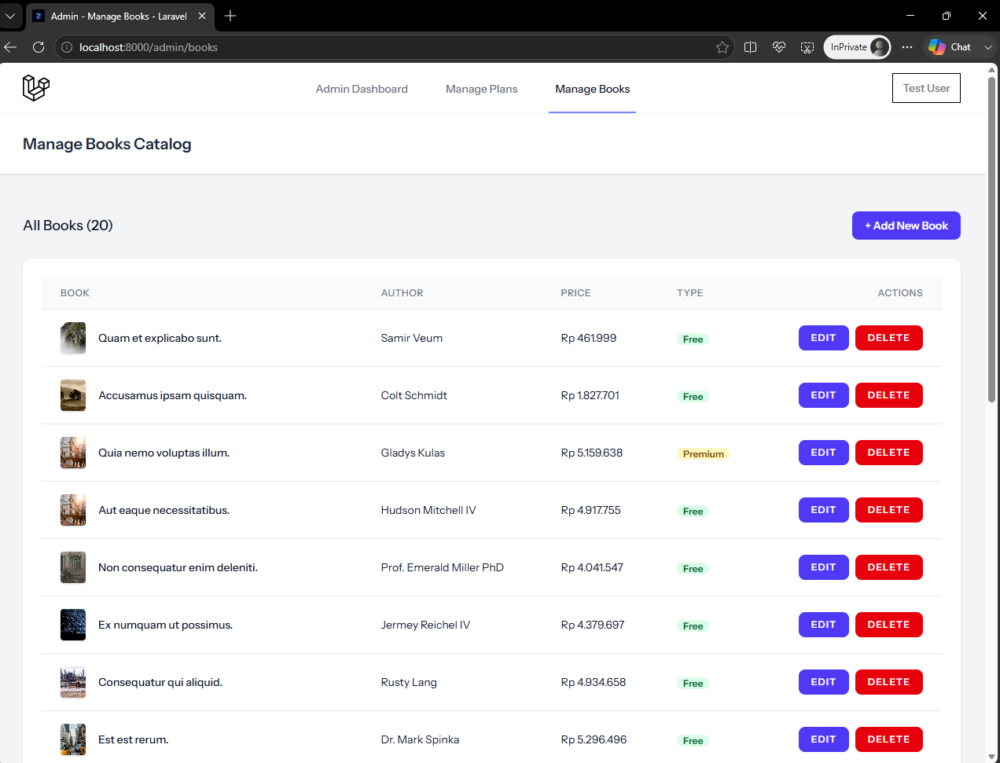
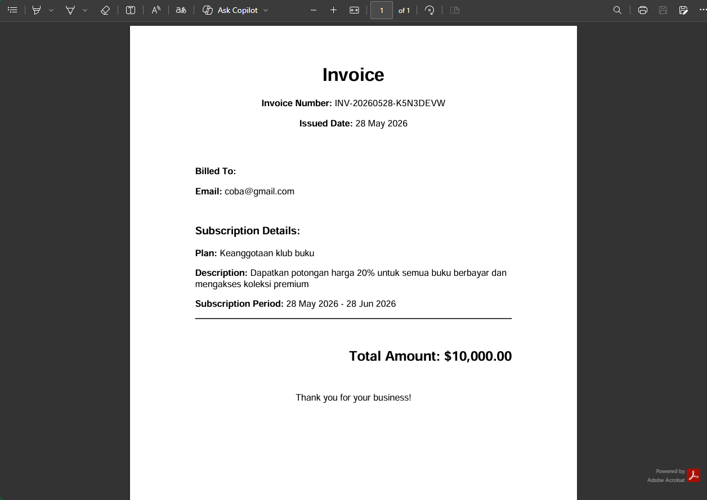
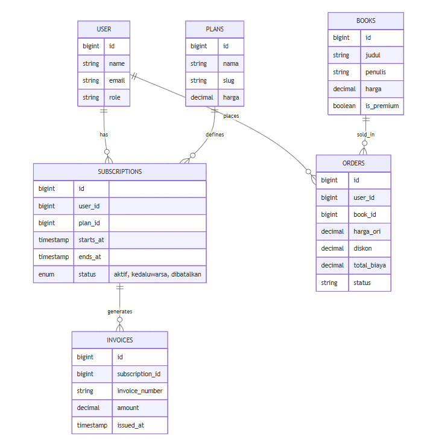
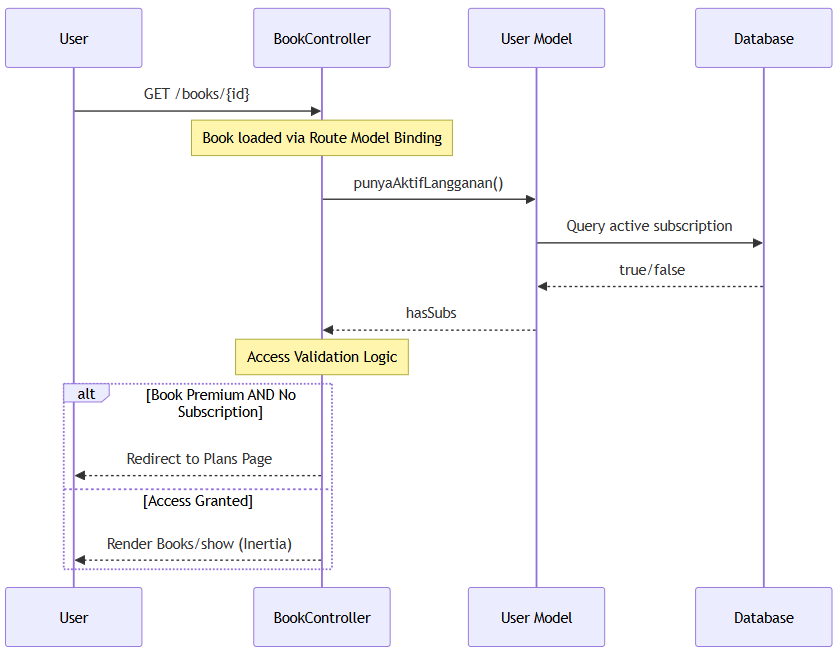
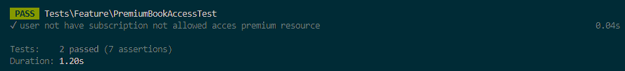

# LITPass: Subscription Based Digital Library Platform

LITPass adalah platform manajemen buku berbasis langganan yang dibangun menggunakan Laravel 12 dan React (Inertia.js). Proyek ini mensimulasikan alur bisnis SaaS, mulai dari manajemen limitasi resource hingga PDF Invoice Generation System.

---

## Preview


*Halaman utama Panel Admin yang berfungsi sebagai pusat navigasi untuk pengelolaan data pengguna, paket langganan, dan katalog buku.*

---

## Fitur Utama

*   **Multi-tier Subscription**: Pengelolaan paket langganan (Plans) dengan fleksibilitas konfigurasi harga dan limitasi.
*   **Dynamic Access Control**: Sistem proteksi resource yang membatasi akses buku berdasarkan status aktif langganan pengguna.
*   **Automated Invoicing**: Integrasi otomatisasi pembuatan invoice PDF setiap kali transaksi berhasil diproses.
*   **Admin Management**: Panel kendali untuk manajemen inventaris buku, data pengguna, dan paket langganan secara terpusat.

---

## Dokumentasi Visual

Untuk memberikan gambaran alur bisnis yang diimplementasikan, berikut adalah beberapa tangkapan layar fitur utama:

| Pemilihan Paket Langganan | Alur Checkout & Transaksi |
|---|---|
|  |  |
| *User memilih paket untuk mendapatkan akses.* | *Proses transaksi yang terintegrasi dengan database.* |

| Manajemen Buku (Admin) | Hasil Invoicing (PDF) |
|---|---|
|  |  |
| *Panel Admin untuk kontrol inventaris.* | *Output invoice setelah membeli plan.* |

---

## Desain Sistem dan Database

Dokumentasi arsitektur sistem dan struktur data:

<details>
  <summary><b>Klik untuk melihat Arsitektur (ERD & Sequence Diagram)</b></summary>

  ### Entity Relationship Diagram (ERD)
  

  ### Sequence Diagram
  

</details>

---

## Tech Stack

*   **Backend**: Laravel 12 (PHP 8.2+)
*   **Frontend**: React.js, Tailwind CSS, Inertia.js
*   **Database**: MySQL
*   **Testing**: PHPUnit (Unit & Feature Testing)
*   **Build Tool**: Vite

---

## Quality Assurance (Testing)

Untuk memastikan keandalan sistem, proyek ini dilengkapi dengan pengujian otomatis (Automated Testing) menggunakan PHPUnit:

| Skenario Pengujian | Hasil Pengujian |
|---|---|
| **Akses Kontrol Paket Premium**: Memastikan pengguna tanpa paket premium tidak dapat melakukan pembelian/akses fitur eksklusif. |  |
| **Logika Diskon 20%**: Validasi perhitungan harga pada Order untuk memastikan diskon 20% diterapkan dengan benar. |  |

---

## Panduan Instalasi

```bash
# Clone repository
git clone https://github.com/zplusplus0life/LITPass.git
cd LITPass

# Install dependencies
composer install
npm install

# Environment configuration
cp .env.example .env
php artisan key:generate

# Database setup
php artisan migrate --seed

# Run development server
npm run dev
php artisan serve
```

---

## Video Demo

*   **Link Video**: [LITPass](https://youtube.com/belum-ada-video)

---

## Kontak

*   **Email**: [zackyfirdaus934@gmail.com]
*   **LinkedIn**: [https://www.linkedin.com/in/zplusplus0life]
